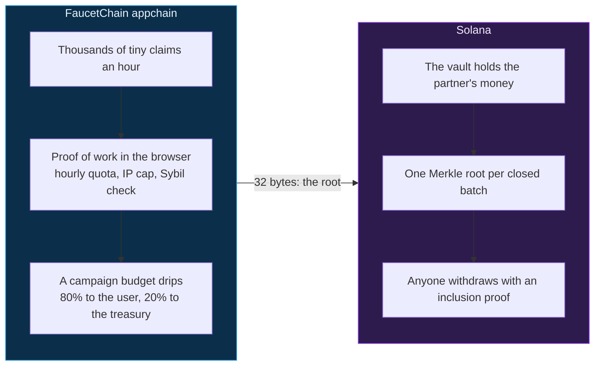
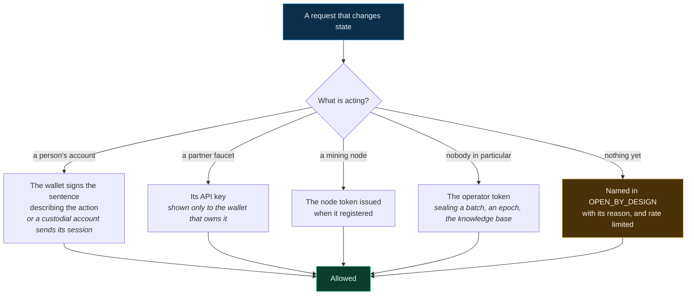
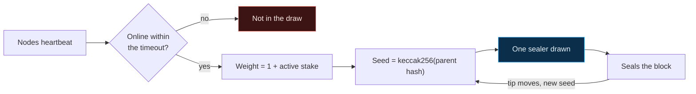

# How FaucetChain works, in diagrams

The prose version is [ARCHITECTURE.md](ARCHITECTURE.md). This is the same
system drawn, for reading before the prose rather than instead of it.

Every number here was read out of the code rather than remembered. Where a
diagram and the code disagree, the code is right and this file is a bug.

> The flowchart under `legacy/docs/fluxograma/` describes the EVM appchain this
> project used to be. It is kept as the honest record of that period and is not
> maintained. This file is the current one.

---

## The two layers, and why there are two

A micro-claim worth a fraction of a cent cannot carry a transaction fee, so
distribution happens off-chain. But a balance in somebody's database is a
promise, not money — so the money itself never leaves Solana. **The only thing
that crosses between the layers is a 32-byte root.** Partner funds do not
bridge; they enter the vault and leave it to the users.

---

## A click becoming money

The whole path, from somebody clicking a partner faucet to holding a token
they can spend. Nothing here is mocked.

```mermaid
sequenceDiagram
    autonumber
    participant U as User
    participant F as Partner faucet
    participant C as FaucetChain
    participant S as Solana

    U->>F: clicks, earns the faucet's own reward
    F->>F: pays it through FaucetPay, as always
    Note over F: this already happened before we are called

    F->>C: POST /api/faucethub/microclaim (X-Api-Key)
    Note over F,C: 5s timeout, failure ignored:<br/>if we are down, their payout still happened

    C->>C: cooldown 300s per user per faucet
    C->>C: hourly quota 2,000 $CLAIM, cap 99,000,000
    C->>C: drip: debit the budget, 80% user, 20% treasury owed
    C-->>F: credited, plus what each campaign gave

    U->>C: links a Solana wallet (two signatures)
    Note over U,C: one says which wallet, one proves he holds its key

    C->>C: batch closes, leaves hashed into a root
    C->>S: publish_root
    S-->>C: refused if the vault cannot cover it

    U->>C: asks for the proof of his leaf
    U->>S: withdraw(amount, proof)
    S->>S: checks the proof, then the leaf's own bit
    S-->>U: tokens, gas paid by the relayer

    Note over U,S: he never held SOL
```

**Step 3 is the one to notice.** The partner's own payment happens *before*
FaucetChain is called, and the call is allowed to fail. An integration that
makes somebody else's payout depend on our uptime is one that dies at the first
instability, and deserves to.

**Step 11 is the guarantee.** The program refuses a root the vault cannot
cover, so the reserve is checked on-chain instead of reported by a server. The
sequencer cannot promise what the partner did not fund, even if it wants to.

---

## What stops each thing that could go wrong

| Where | What could go wrong | What actually stops it |
| --- | --- | --- |
| The click | One person farming as a thousand | Browser proof of work, 5 wallets per IP per hour, Sentinel |
| The drip | A campaign paying past its budget | The budget is a ceiling checked at credit time, and a period cap the sponsor sets |
| The batch | A sequencer promising more than exists | `publish_root` refuses a root the vault cannot cover |
| The withdrawal | Collecting the same leaf twice | One bit per leaf in the root; a replay fails on a bit already set |
| The withdrawal | Claiming somebody else's leaf | The proof only verifies against the leaf's own recipient and amount |
| The payout | Delivering less than promised | Campaigns take classic SPL mints only — a Token-2022 transfer fee would pay 98 where the leaf published 100 |

---

## Who is allowed to do what

Every route that changes state needs a reason to trust its caller. There are
four, and a route with none of them fails `test_endpoint_inventory.py`.

The sentence a wallet signs is built by `settlement.py` and rebuilt by the
browser in `utils/actionMessage.ts`. `scripts/check_messages.py` runs both and
compares byte for byte, because a single space of drift reads as "invalid
signature" miles from its cause.

---

## Who seals a block

Mining here is proof of presence, not proof of work. A node heartbeats, and
being online is what makes it eligible.

The seed comes from the parent hash, so the draw is deterministic and anybody
can recompute who *should* have sealed. The `+1` keeps a node with no stake in
the draw at all.

**Today this election has no participants.** Two nodes are registered and none
is running, so `select_block_sealer` returns nothing and sealing falls back to
whoever asks. The mechanism is real and currently empty — worth knowing before
reading the diagram as a description of a live validator set.

---

## What these diagrams do not show

- **The money is on devnet.** Tokens there are free, so nothing above is
  protecting value yet.
- **The sequencer is one process.** The election is real, but with no miners
  online there is one party ordering transactions.
- **The upgrade authority is a single key** held by the team, stated in
  [README.md](README.md). It outranks everything drawn here.
- **The FaucetPay link is identity only.** No money moves through it, and an
  account counts as proved only when a payment arrives from it.
