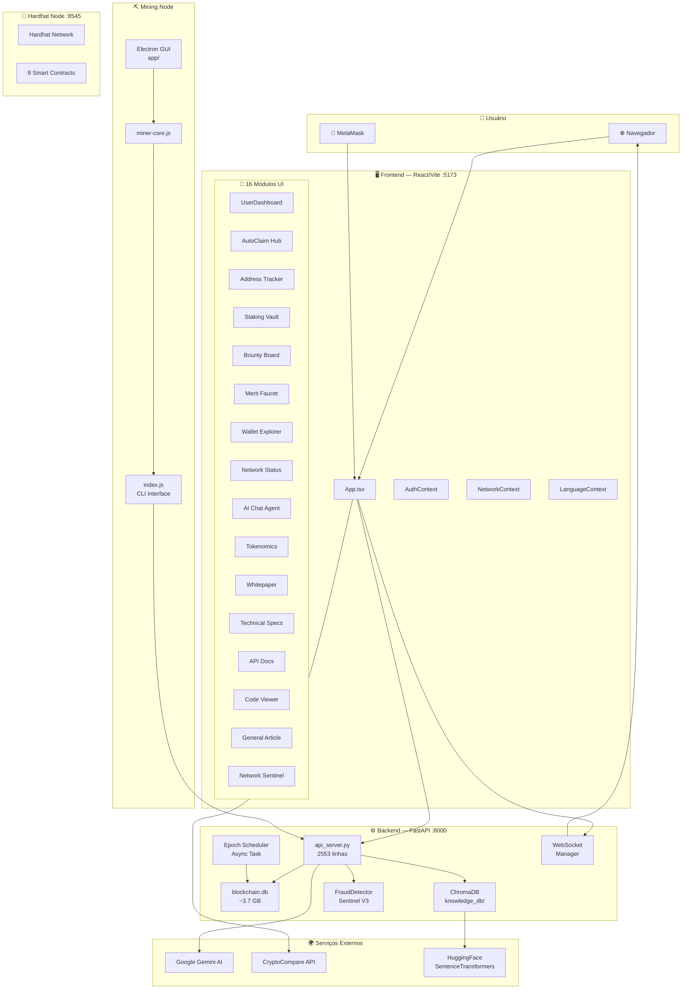
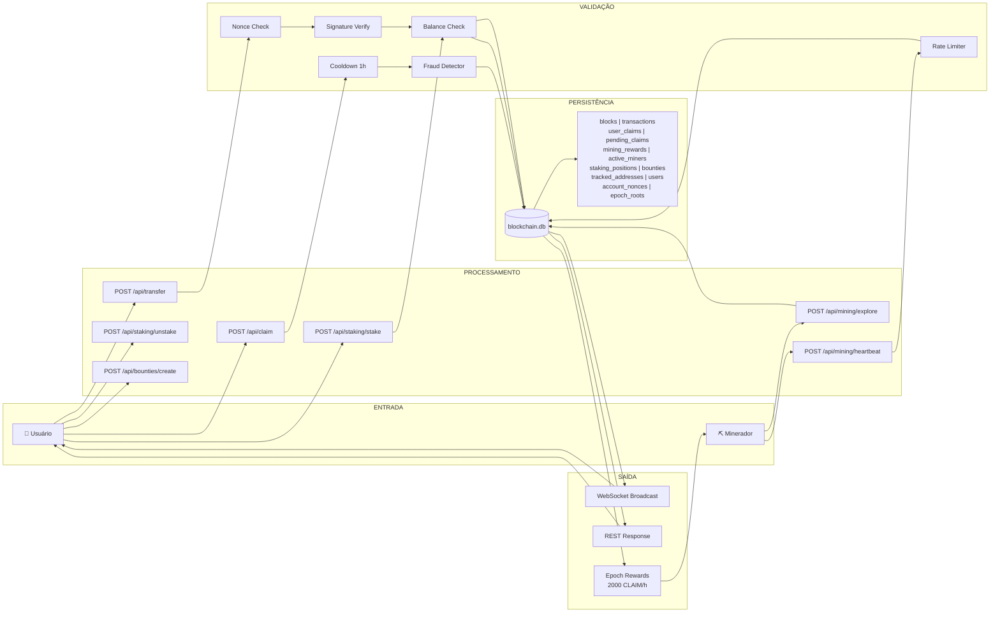
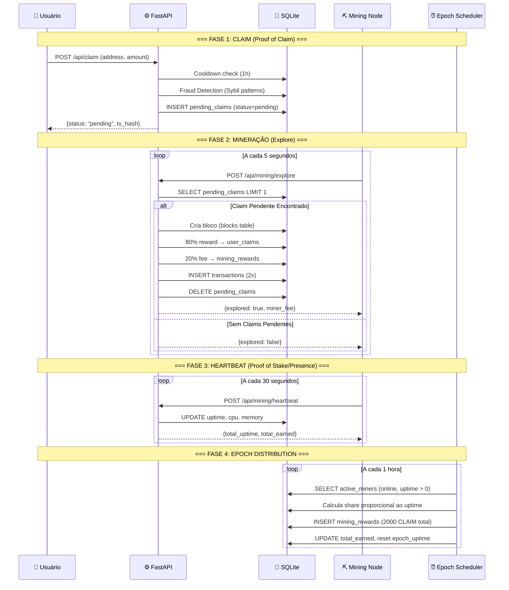
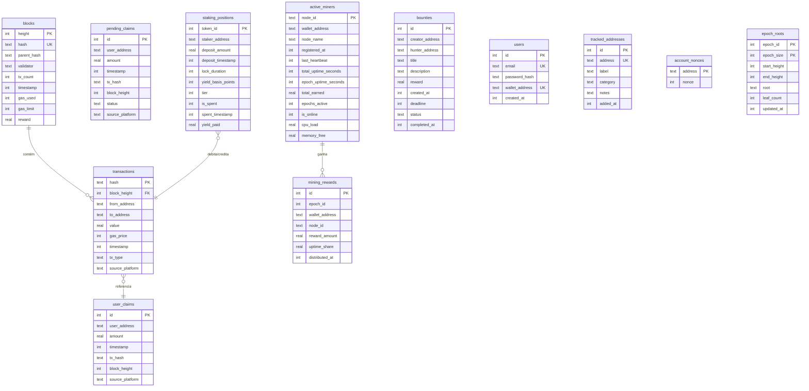
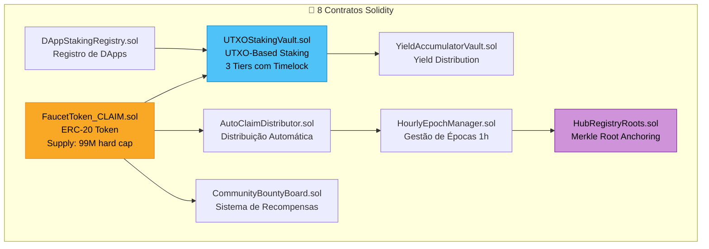
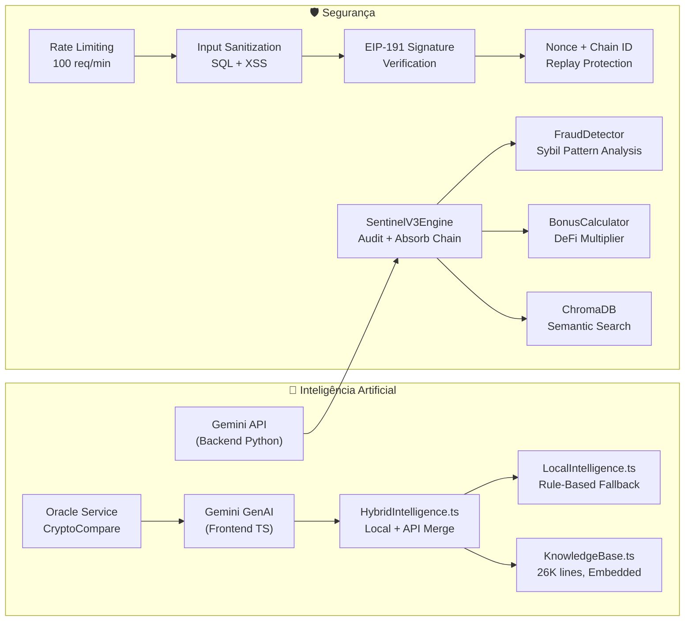
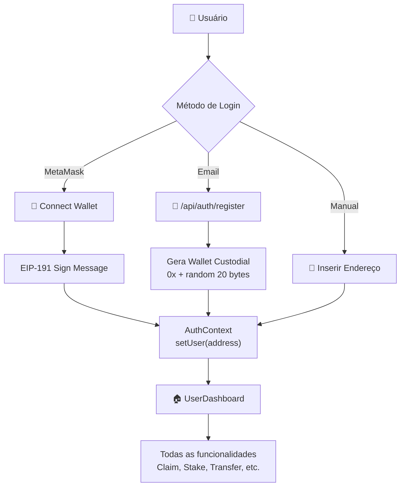
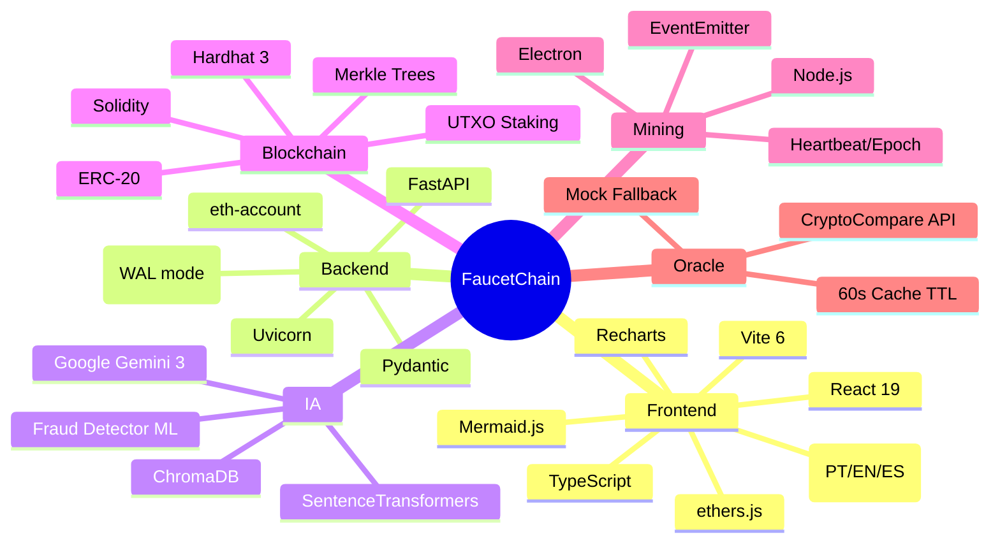

# 🌐 FaucetChain — Fluxograma do Ecossistema Completo

## Visão Geral da Arquitetura

A FaucetChain é uma blockchain Layer 1 local com consenso híbrido **PoC + PoS** (Proof of Claim + Proof of Stake). O ecossistema é composto por **4 camadas principais**:

| Camada | Tecnologia | Porta |
|---|---|---|
| 🖥️ Frontend (DApp) | React + Vite | `:5173` |
| ⚙️ Backend API | FastAPI + Uvicorn | `:8000` |
| ⛏️ Mining Node | Node.js CLI/Electron | — |
| 🔗 Smart Contracts | Solidity (Hardhat) | `:8545` |

---

## 1. Arquitetura de Serviços (Macro)



---

## 2. Fluxo de Dados Completo



---

## 3. Ciclo de Vida do Consenso (PoC + PoS)



---

## 4. Estrutura do Banco de Dados



---

## 5. Smart Contracts (Solidity — Hardhat :8545)



---

## 6. Camada de IA e Segurança



---

## 7. Mapa Completo de API Endpoints

### Core
| Método | Rota | Descrição |
|---|---|---|
| `GET` | `/api/health` | Health check |
| `GET` | `/api/blocks` | Blocos recentes |
| `GET` | `/api/tx/{hash}` | Detalhes de transação |
| `GET` | `/api/network-metrics` | Métricas da rede |
| `WS` | `/ws/network` | Blocos em tempo real |

### Faucet & Claims
| Método | Rota | Descrição |
|---|---|---|
| `POST` | `/api/claim` | Submeter claim |
| `GET` | `/api/claim/status/{hash}` | Status do claim |
| `GET` | `/api/user/{addr}/claims` | Histórico de claims |
| `GET` | `/api/user/{addr}/balance` | Saldo agregado |

### Transfers (Assinado)
| Método | Rota | Descrição |
|---|---|---|
| `POST` | `/api/transfer` | Transferir $CLAIM (assinado) |
| `GET` | `/api/user/{addr}/nonce` | Nonce atual |
| `GET` | `/api/address/{addr}/transactions` | Histórico TXs |

### Mining
| Método | Rota | Descrição |
|---|---|---|
| `POST` | `/api/mining/register` | Registrar nó |
| `POST` | `/api/mining/heartbeat` | Heartbeat |
| `POST` | `/api/mining/explore` | Explorar claims pendentes |
| `POST` | `/api/mining/disconnect` | Desconectar nó |
| `POST` | `/api/mining/distribute-epoch` | Distribuir epoch manual |
| `GET` | `/api/mining/stats` | Estatísticas globais |
| `GET` | `/api/mining/leaderboard` | Top mineradores |
| `GET` | `/api/mining/node/{addr}` | Info do nó |
| `GET` | `/api/mining/rewards/{addr}` | Rewards do minerador |

### Staking Vault
| Método | Rota | Descrição |
|---|---|---|
| `POST` | `/api/staking/stake` | Criar posição UTXO |
| `POST` | `/api/staking/unstake` | Resgatar UTXO |
| `GET` | `/api/staking/positions/{addr}` | Posições do usuário |
| `GET` | `/api/staking/stats` | Stats do vault |

### Bounty Board
| Método | Rota | Descrição |
|---|---|---|
| `POST` | `/api/bounties/create` | Criar bounty |
| `POST` | `/api/bounties/{id}/claim` | Aceitar bounty |
| `POST` | `/api/bounties/{id}/approve` | Aprovar bounty |
| `POST` | `/api/bounties/{id}/cancel` | Cancelar bounty |
| `GET` | `/api/bounties/list` | Listar bounties |
| `GET` | `/api/bounties/user/{addr}` | Bounties do usuário |
| `GET` | `/api/bounties/stats` | Stats do board |

### Address Tracker
| Método | Rota | Descrição |
|---|---|---|
| `GET` | `/api/tracker/addresses` | Listar watchlist |
| `POST` | `/api/tracker/addresses` | Adicionar endereço |
| `DELETE` | `/api/tracker/addresses/{addr}` | Remover endereço |
| `GET` | `/api/tracker/addresses/{addr}/activity` | Atividade completa |
| `GET` | `/api/tracker/summary` | Resumo por categoria |

### Auth
| Método | Rota | Descrição |
|---|---|---|
| `POST` | `/api/auth/register` | Registro (email + wallet custodial) |
| `POST` | `/api/auth/login` | Login |

### AI & Knowledge
| Método | Rota | Descrição |
|---|---|---|
| `POST` | `/api/ai/sentinel` | Sentinel AI (Gemini + L1 Data) |
| `POST` | `/api/vector-search` | Busca semântica |
| `POST` | `/api/add-document` | Adicionar documento ao KB |

### Merkle Proofs
| Método | Rota | Descrição |
|---|---|---|
| `GET` | `/api/epoch/{id}/root` | Merkle root do epoch |
| `GET` | `/api/blocks/{height}/merkle-proof` | Prova de inclusão |

### L1 V3 State
| Método | Rota | Descrição |
|---|---|---|
| `GET` | `/api/epoch/status` | Status do epoch atual |
| `GET` | `/api/vault/yield` | Yield do vault externo |
| `GET` | `/api/faucets/staked` | DApps com stake |

---

## 8. Fluxo de Autenticação



---

## 9. Fórmula de Saldo

```
Balance = claims_total + mining_total + incoming_transfers - outgoing_transfers
```

Onde:
- **claims_total** = `SUM(user_claims.amount)` — Merit Faucet claims
- **mining_total** = `SUM(mining_rewards.reward_amount)` — Epoch rewards
- **incoming_transfers** = `SUM(transactions.value) WHERE to_address = user` — Inclui unstake payouts
- **outgoing_transfers** = `SUM(transactions.value) WHERE from_address = user` — Inclui stake locks

> [!IMPORTANT]
> O staking debita via `transactions` (from=user, to=VAULT) e credita no unstake (from=VAULT, to=user), mantendo o saldo integrado sem duplicação.

---

## 10. Tiers de Staking

| Tier | Duração | Yield (Basis Points) | Yield Efetivo |
|---|---|---|---|
| 0 — Curto | 1 hora | 50 bp | 0.50% |
| 1 — Médio | 24 horas | 200 bp | 2.00% |
| 2 — Longo | 7 dias | 1000 bp | 10.00% |

---

## 11. Stack Tecnológico Resumido


