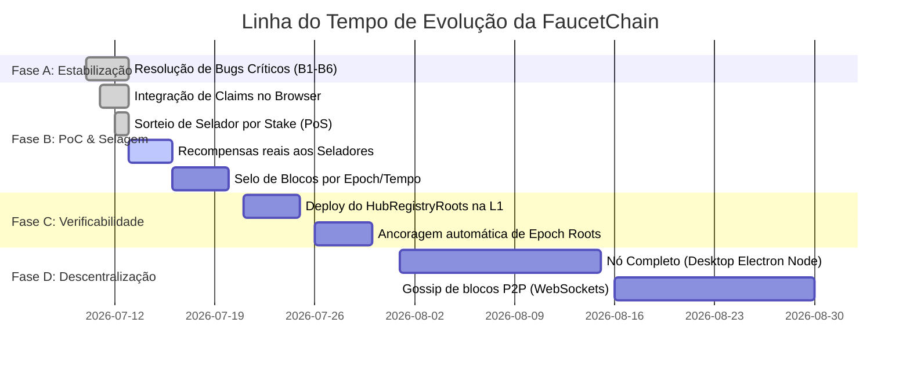

# FaucetChain — Relatório Técnico de Endurecimento e Melhorias do Protocolo

> **Data:** 13 de Julho de 2026  
> **Status:** Fase B em progresso (Endurecimento da integridade do ledger concluído)  
> **Escopo:** Análise e documentação das mudanças recentes de segurança, correção de bugs estruturais de contabilidade, tokenomics e planejamento da linha do tempo evolutiva para descentralização da FaucetChain.

---

## 1. Histórico de Mudanças Implementadas (Julho 2026)

A FaucetChain passou por uma auditoria e refatoração crítica para alinhar a implementação real com a especificação descrita nos contratos Solidity e no Whitepaper. As seguintes melhorias estruturais foram implementadas com sucesso:

### A. Correções de Integridade e Contabilidade do Ledger
*   **Resolução da dupla contagem de saldo (Bug B1):** O cálculo do saldo agregado do usuário (`get_user_balance` em `api_server.py`) estava duplicando os valores dos claims. Isso ocorria porque as transações de claim e as recompensas de mineração eram salvas tanto na tabela de claims/recompensas quanto na tabela unificada de transações (como transações tipo `CLAIM` ou `MINING_FEE`). A lógica foi corrigida para que a soma de transações de entrada e saída de saldo ignore esses tipos de transações espelho.
*   **Desvinculação da Sepolia (Bug B2):** O banco de dados continha mais de 10 milhões de transações reais de Ethereum da Sepolia (em ETH) misturadas com os saldos de `$CLAIM`. Utilizando o script `desvincular_sepolia.py`, essas transações externas foram expurgadas da tabela de produção e o banco antigo foi preservado em `blockchain_sepolia_backup.db`.
*   **Soberania da Cadeia Nativa (Bug B3):** Os blocos nativos eram enxertados no banco de dados continuando a numeração de altura da Sepolia (~10,35M). Com a mudança, a FaucetChain nativa passou a ter um bloco gênese próprio (altura 0, Chain ID 7777), com a renomeação e recálculo do encadeamento criptográfico de hashes (`parent_hash` + `sha256`) dos blocos nativos existentes.

### B. Alinhamento com a Tokenomics do Protocolo
*   **Aplicação do Hard Cap de 99M (Bug B4):** O limite de suprimento máximo de 99.000.000 de tokens `$CLAIM` — antes definido apenas no contrato Solidity mas inativo na API — foi incorporado diretamente no backend. Agora, as emissões no `/api/mining/explore` e no agendador de epochs verificam se o limite foi atingido, rejeitando novos claims com o status `rejected_max_supply`.
*   **Quota Horária e Hiato (Bug B5):** A quota horária global de emissão de 2.000 `$CLAIM/hora` (que era simulada como 50.000 estática em memória) foi implementada usando a tabela `hourly_epochs`. Ao atingir a quota de 2.000 tokens na hora vigente, o sistema entra em hiato, bloqueando novos mints temporariamente e mantendo os claims na fila FIFO para serem processados no início da próxima hora.

### C. Fortalecimento da Segurança e Criptografia
*   **Assinaturas de Ação Obrigatórias (Bug B6):** Anteriormente, apenas transferências exigiam verificação ECDSA. A verificação criptográfica foi estendida aos endpoints de claim, stake e unstake utilizando o helper `require_action_signature()`. 
    *   Exige assinatura EIP-191 (`personal_sign`) amarrada ao Chain ID 7777 e com timestamp de validade de 300 segundos.
    *   Implementa deduplicação contra ataques de replay via tabela `used_signatures`.
    *   Contas custodiais (como login via Google ou e-mail) permanecem gerenciadas de forma centralizada pelo servidor.

---

## 2. Linha do Tempo e Roadmap de Evolução do Protocolo

Abaixo está o roadmap atualizado para a transição completa da FaucetChain de um "Sequenciador centralizado auditável" para uma "Rede soberana descentralizada".

### Detalhamento das Fases

#### Fase A — Integridade do Ledger (Concluída - Julho 2026)
*   **Foco:** Garantir que o banco de dados nativo seja canônico, sem contaminação externa (Sepolia) e com contabilidade exata.
*   **Entregas:** Correções dos bugs B1, B2, B3, B4, B5 e B6. A cadeia possui agora o Genesis nativo real e verificação de assinatura em todas as transações que alteram saldos.

#### Fase B — Proof of Claim Criptográfico (Fase Atual)
*   **Foco:** Substituir requisições HTTP arbitrárias por provas de computação criptográfica para evitar spam de bots, mantendo o modelo de mineração por clique.
*   **O que já está implementado:**
    *   **Browser (Faucet.tsx):** A interface consome o endpoint `/api/poc/challenge` e resolve localmente o nonce do desafio até atingir a dificuldade (16 bits em zero).
    *   **Backend (api_server.py):** Endpoint de validação da prova e sorteio determinístico do selador do bloco (`select_block_sealer`) ponderado pelo stake (PoS).
*   **Pendências de Melhoria Imediata:**
    *   **Pagamento Real de Recompensa de Mineração:** Garantir que o validador/selador sorteado receba sua taxa de 20% e o minerador originador do claim receba 80% diretamente nas tabelas financeiras ao minerar o bloco nativo.
    *   **Frequência de Bloco por Tempo (Selagem Periódica):** Atualmente, cada claim pendente força a selagem de um bloco de forma imediata pelo minerador. A transição correta deve agrupar transações e selar um bloco periodicamente (ex: a cada 30 segundos ou N claims pendentes), reduzindo a sobrecarga.

#### Fase C — Verificabilidade Externa (Ponte L1/L2)
*   **Foco:** Remover a necessidade de confiança cega no servidor central, permitindo auditoria pública.
*   **Ações:**
    1. Realizar o deploy do contrato `HubRegistryRoots.sol` na testnet Sepolia.
    2. Desenvolver a automação no backend para realizar chamadas periódicas à Sepolia, enviando o Merkle root de cada epoch de blocos nativos.
    3. Habilitar o endpoint `/api/chain/export` para parceiros baixarem e reconstruírem o estado do ledger local, comparando a raiz resultante com a registrada on-chain na Sepolia.

#### Fase D — Descentralização e Consenso P2P
*   **Foco:** Migrar a arquitetura de sequenciador central para uma rede descentralizada de nós validadores.
*   **Ações:**
    1. Evoluir o software Electron do `mining-node` para atuar como um nó completo (manter banco de dados local, validar blocos assinados por outros seladores).
    2. Implementar a propagação de transações (mempool) e blocos através de WebSocket/Gossip.
    3. Definir regras simples de escolha de ramificação (fork choice rule) com base na cadeia mais longa válida assinada pelo selador sorteado.

---

## 3. Próximas Tarefas Recomendadas

1.  **Refatoração do Loop de Selagem (Fase B):**
    Ajustar o endpoint `/api/mining/explore` e o indexador de blocos para acumular transações no mempool (`pending_claims`) e selar blocos em intervalos de tempo, em vez de gerar um bloco por claim.
2.  **Distribuição de Taxas no Código de Mineração:**
    Validar se as transações de recompensa estão sendo criadas e creditadas corretamente para o selador sorteado no banco `blockchain.db` nativo durante a chamada de mineração.
3.  **Simulação de Múltiplos Validadores:**
    Configurar instâncias locais de teste com chaves privadas diferentes para validar o sorteio ponderado de validadores (`select_block_sealer`) em sandbox.
