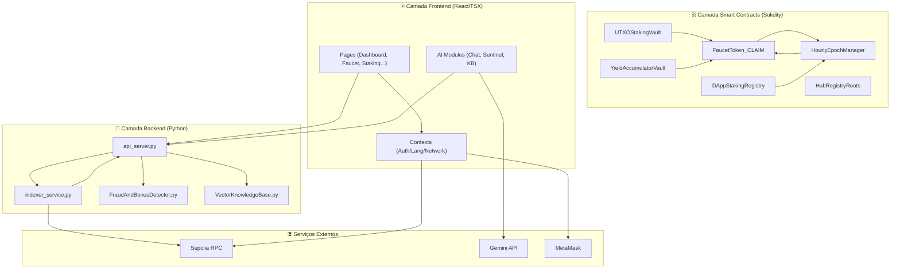
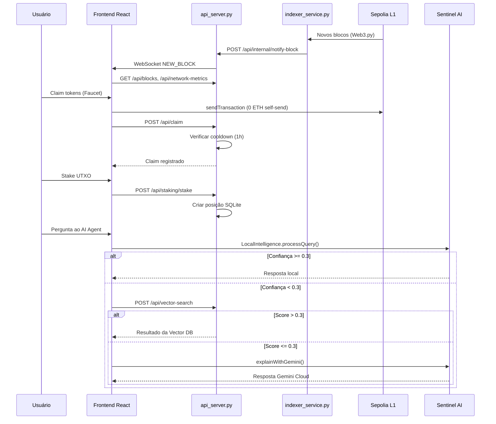

# FaucetChain — Análise Completa de Componentes

> Relatório gerado em 19/04/2026 — Análise de 50+ arquivos em 6 camadas arquiteturais.

---

## 1. Visão Geral da Arquitetura



---

## 2. Tabela Mestre de Componentes

### 2.1 Smart Contracts (Solidity)

| Contrato | Arquivo | Função | Depende de | Influencia |
|---|---|---|---|---|
| **FaucetToken_CLAIM** | [FaucetToken_CLAIM.sol](file:///c:/Users/Administrator/Downloads/copy-of-copy-of-test-net-hybrid-poc+pos-consensus-explorer/contracts/FaucetToken_CLAIM.sol) | Token ERC-20 nativo `$CLAIM`. Supply fixo de 99M. Minting restrito ao `HourlyEpochManager`. Opt-in burn. | OpenZeppelin ERC20 | `HourlyEpochManager`, `UTXOStakingVault`, `DAppStakingRegistry`, `YieldAccumulatorVault` |
| **HourlyEpochManager** | [HourlyEpochManager.sol](file:///c:/Users/Administrator/Downloads/copy-of-copy-of-test-net-hybrid-poc+pos-consensus-explorer/contracts/HourlyEpochManager.sol) | Gerencia epoques horárias de mineração. Quota de 2.000 CLAIM/hora. Sistema de hiato (se a quota esgotar, faucets param até a próxima hora). | `FaucetToken_CLAIM`, `DAppStakingRegistry` | Controla toda a emissão de tokens; bloqueia faucets quando quota se esgota |
| **DAppStakingRegistry** | [DAppStakingRegistry.sol](file:///c:/Users/Administrator/Downloads/copy-of-copy-of-test-net-hybrid-poc+pos-consensus-explorer/contracts/DAppStakingRegistry.sol) | Registro de DApps (faucets) autorizadas. Exige stake mínimo de 10.000 CLAIM para plug-in. | `FaucetToken_CLAIM` (IERC20) | `HourlyEpochManager` (validação de faucets autorizadas) |
| **UTXOStakingVault** | [UTXOStakingVault.sol](file:///c:/Users/Administrator/Downloads/copy-of-copy-of-test-net-hybrid-poc+pos-consensus-explorer/contracts/UTXOStakingVault.sol) | Staking estilo UTXO. Cada depósito gera NFT ERC-721 com timelock e yield. 3 tiers: 1h (0.5%), 24h (2%), 7d (10%). Burn do NFT para retirada. | `FaucetToken_CLAIM` (IERC20), OpenZeppelin ERC721Enumerable | Frontend [StakingVault.tsx](file:///c:/Users/Administrator/Downloads/copy-of-copy-of-test-net-hybrid-poc+pos-consensus-explorer/components/StakingVault.tsx), API staking endpoints |
| **YieldAccumulatorVault** | [YieldAccumulatorVault.sol](file:///c:/Users/Administrator/Downloads/copy-of-copy-of-test-net-hybrid-poc+pos-consensus-explorer/contracts/YieldAccumulatorVault.sol) | Absorve tokens PoS externos (ETH, POL) e gera yield cross-chain redistribuído à rede. | `FaucetToken_CLAIM` (IERC20) | Tokenomics: TVL externo e yield distribuído |
| **HubRegistryRoots** | [HubRegistryRoots.sol](file:///c:/Users/Administrator/Downloads/copy-of-copy-of-test-net-hybrid-poc+pos-consensus-explorer/contracts/HubRegistryRoots.sol) | Registro on-chain de Hubs (L2) + publicação de Merkle roots por epoch. Ancora dados off-chain na L1. | Nenhum (standalone) | [NetworkStatus.tsx](file:///c:/Users/Administrator/Downloads/copy-of-copy-of-test-net-hybrid-poc+pos-consensus-explorer/components/NetworkStatus.tsx) (verificação de provas Merkle), [merkle.ts](file:///c:/Users/Administrator/Downloads/copy-of-copy-of-test-net-hybrid-poc+pos-consensus-explorer/utils/merkle.ts) |

---

### 2.2 Backend Python

| Módulo | Arquivo | Função | Depende de | Influencia |
|---|---|---|---|---|
| **API Server** | [api_server.py](file:///c:/Users/Administrator/Downloads/copy-of-copy-of-test-net-hybrid-poc+pos-consensus-explorer/api_server.py) | FastAPI central (882 linhas). 20+ endpoints: blocos, transações, claims, staking UTXO, epoch, vault, vector search, WebSocket. Rate limiting, sanitização, audit logging. | [VectorKnowledgeBase.py](file:///c:/Users/Administrator/Downloads/copy-of-copy-of-test-net-hybrid-poc+pos-consensus-explorer/VectorKnowledgeBase.py), SQLite ([blockchain.db](file:///c:/Users/Administrator/Downloads/copy-of-copy-of-test-net-hybrid-poc+pos-consensus-explorer/blockchain.db)), `eth-hash`/`pycryptodome` | **Todos** os componentes frontend que fazem fetch; [indexer_service.py](file:///c:/Users/Administrator/Downloads/copy-of-copy-of-test-net-hybrid-poc+pos-consensus-explorer/indexer_service.py) (notificação de blocos) |
| **Indexer Service** | [indexer_service.py](file:///c:/Users/Administrator/Downloads/copy-of-copy-of-test-net-hybrid-poc+pos-consensus-explorer/indexer_service.py) | Indexa blocos e transações da Sepolia em tempo real via Web3.py. Sincroniza continuamente e notifica a API via WebSocket. | Sepolia RPC, SQLite, [api_server.py](file:///c:/Users/Administrator/Downloads/copy-of-copy-of-test-net-hybrid-poc+pos-consensus-explorer/api_server.py) (WebSocket notify) | [api_server.py](file:///c:/Users/Administrator/Downloads/copy-of-copy-of-test-net-hybrid-poc+pos-consensus-explorer/api_server.py) (dados de blocos/txs), [NetworkContext.tsx](file:///c:/Users/Administrator/Downloads/copy-of-copy-of-test-net-hybrid-poc+pos-consensus-explorer/components/NetworkContext.tsx) (métricas via WebSocket) |
| **Fraud & Bonus Detector** | [FraudAndBonusDetector.py](file:///c:/Users/Administrator/Downloads/copy-of-copy-of-test-net-hybrid-poc+pos-consensus-explorer/FraudAndBonusDetector.py) | Motor ML Sentinel V3. FraudDetector (Sybil via compressão), BonusCalculator (DeFi multiplier 1.0-2.5x), SentinelV3Engine (orquestração + absorção de dados da chain). | [VectorKnowledgeBase.py](file:///c:/Users/Administrator/Downloads/copy-of-copy-of-test-net-hybrid-poc+pos-consensus-explorer/VectorKnowledgeBase.py), SQLite | Validação de nós, multiplicadores de recompensa, health report |
| **Vector Knowledge Base** | [VectorKnowledgeBase.py](file:///c:/Users/Administrator/Downloads/copy-of-copy-of-test-net-hybrid-poc+pos-consensus-explorer/VectorKnowledgeBase.py) | Base de conhecimento vetorial com ChromaDB + Sentence-Transformers (`all-MiniLM-L6-v2`). Busca semântica em docs do protocolo + dados da blockchain. | `chromadb`, `sentence-transformers` | [api_server.py](file:///c:/Users/Administrator/Downloads/copy-of-copy-of-test-net-hybrid-poc+pos-consensus-explorer/api_server.py) (endpoint `/api/vector-search`), [AIChatAgent.tsx](file:///c:/Users/Administrator/Downloads/copy-of-copy-of-test-net-hybrid-poc+pos-consensus-explorer/components/AIChatAgent.tsx) (fallback semântico) |

---

### 2.3 Frontend — Context Providers (Estado Global)

| Contexto | Arquivo | Função | Depende de | Influencia |
|---|---|---|---|---|
| **AuthContext** | [AuthContext.tsx](file:///c:/Users/Administrator/Downloads/copy-of-copy-of-test-net-hybrid-poc+pos-consensus-explorer/components/AuthContext.tsx) | Autenticação centralizada (Google/Email/Wallet). Persiste em localStorage. Dispara eventos `wallet_connected`/`wallet_disconnected`. | React, localStorage | **Todos** os componentes: [Header](file:///c:/Users/Administrator/Downloads/copy-of-copy-of-test-net-hybrid-poc+pos-consensus-explorer/components/Header.tsx#8-151), [Faucet](file:///c:/Users/Administrator/Downloads/copy-of-copy-of-test-net-hybrid-poc+pos-consensus-explorer/components/Faucet.tsx#17-295), [UserDashboard](file:///c:/Users/Administrator/Downloads/copy-of-copy-of-test-net-hybrid-poc+pos-consensus-explorer/components/UserDashboard.tsx#21-267), [StakingVault](file:///c:/Users/Administrator/Downloads/copy-of-copy-of-test-net-hybrid-poc+pos-consensus-explorer/components/StakingVault.tsx#67-465), [WalletExplorer](file:///c:/Users/Administrator/Downloads/copy-of-copy-of-test-net-hybrid-poc+pos-consensus-explorer/components/WalletExplorer.tsx#24-335), [AIChatAgent](file:///c:/Users/Administrator/Downloads/copy-of-copy-of-test-net-hybrid-poc+pos-consensus-explorer/components/AIChatAgent.tsx#40-383) |
| **LanguageContext** | [LanguageContext.tsx](file:///c:/Users/Administrator/Downloads/copy-of-copy-of-test-net-hybrid-poc+pos-consensus-explorer/components/LanguageContext.tsx) | Internacionalização EN/PT. Fornece `t` (traduções) de [constants.ts](file:///c:/Users/Administrator/Downloads/copy-of-copy-of-test-net-hybrid-poc+pos-consensus-explorer/constants.ts). | [constants.ts](file:///c:/Users/Administrator/Downloads/copy-of-copy-of-test-net-hybrid-poc+pos-consensus-explorer/constants.ts) (TRANSLATIONS) | [Header](file:///c:/Users/Administrator/Downloads/copy-of-copy-of-test-net-hybrid-poc+pos-consensus-explorer/components/Header.tsx#8-151), [Faucet](file:///c:/Users/Administrator/Downloads/copy-of-copy-of-test-net-hybrid-poc+pos-consensus-explorer/components/Faucet.tsx#17-295), [Tokenomics](file:///c:/Users/Administrator/Downloads/copy-of-copy-of-test-net-hybrid-poc+pos-consensus-explorer/components/Tokenomics.tsx#91-214), [WalletExplorer](file:///c:/Users/Administrator/Downloads/copy-of-copy-of-test-net-hybrid-poc+pos-consensus-explorer/components/WalletExplorer.tsx#24-335), [AIChatAgent](file:///c:/Users/Administrator/Downloads/copy-of-copy-of-test-net-hybrid-poc+pos-consensus-explorer/components/AIChatAgent.tsx#40-383), [NetworkStatus](file:///c:/Users/Administrator/Downloads/copy-of-copy-of-test-net-hybrid-poc+pos-consensus-explorer/components/NetworkStatus.tsx#22-287) |
| **NetworkContext** | [NetworkContext.tsx](file:///c:/Users/Administrator/Downloads/copy-of-copy-of-test-net-hybrid-poc+pos-consensus-explorer/components/NetworkContext.tsx) | Estado da rede em tempo real. Fetch de blocos/métricas via HTTP + WebSocket. Simulação de anomalias (CONGESTION, VALIDATOR_DROP). | [api_server.py](file:///c:/Users/Administrator/Downloads/copy-of-copy-of-test-net-hybrid-poc+pos-consensus-explorer/api_server.py) (HTTP + WebSocket) | [NetworkStatus](file:///c:/Users/Administrator/Downloads/copy-of-copy-of-test-net-hybrid-poc+pos-consensus-explorer/components/NetworkStatus.tsx#22-287), [Faucet](file:///c:/Users/Administrator/Downloads/copy-of-copy-of-test-net-hybrid-poc+pos-consensus-explorer/components/Faucet.tsx#17-295), [AIChatAgent](file:///c:/Users/Administrator/Downloads/copy-of-copy-of-test-net-hybrid-poc+pos-consensus-explorer/components/AIChatAgent.tsx#40-383), [UserDashboard](file:///c:/Users/Administrator/Downloads/copy-of-copy-of-test-net-hybrid-poc+pos-consensus-explorer/components/UserDashboard.tsx#21-267), [NetworkSentinel](file:///c:/Users/Administrator/Downloads/copy-of-copy-of-test-net-hybrid-poc+pos-consensus-explorer/components/NetworkSentinel.tsx#7-81) |

---

### 2.4 Frontend — Componentes de Página

| Componente | Arquivo | Função | Consome (Contexts/APIs) | Influencia |
|---|---|---|---|---|
| **App** | [App.tsx](file:///c:/Users/Administrator/Downloads/copy-of-copy-of-test-net-hybrid-poc+pos-consensus-explorer/App.tsx) | Root da aplicação. Tab router com 13 abas. Wraps: [LanguageProvider](file:///c:/Users/Administrator/Downloads/copy-of-copy-of-test-net-hybrid-poc+pos-consensus-explorer/components/LanguageContext.tsx#15-30) → [AuthProvider](file:///c:/Users/Administrator/Downloads/copy-of-copy-of-test-net-hybrid-poc+pos-consensus-explorer/components/AuthContext.tsx#16-50) → [NetworkProvider](file:///c:/Users/Administrator/Downloads/copy-of-copy-of-test-net-hybrid-poc+pos-consensus-explorer/components/NetworkContext.tsx#45-157). | Todos os providers e pages | Toda a aplicação |
| **Header** | [Header.tsx](file:///c:/Users/Administrator/Downloads/copy-of-copy-of-test-net-hybrid-poc+pos-consensus-explorer/components/Header.tsx) | Barra superior fixa. Modal de autenticação multi-método (Google/Email/MetaMask). Toggle idioma EN/PT. | [AuthContext](file:///c:/Users/Administrator/Downloads/copy-of-copy-of-test-net-hybrid-poc+pos-consensus-explorer/components/AuthContext.tsx#6-13), [LanguageContext](file:///c:/Users/Administrator/Downloads/copy-of-copy-of-test-net-hybrid-poc+pos-consensus-explorer/components/LanguageContext.tsx#7-12), `ethers.js` | Estado global de autenticação |
| **UserDashboard** | [UserDashboard.tsx](file:///c:/Users/Administrator/Downloads/copy-of-copy-of-test-net-hybrid-poc+pos-consensus-explorer/components/UserDashboard.tsx) | Dashboard pessoal do usuário. Mostra saldo ETH + CLAIM, reputação Sentinel, histórico de atividades (txs + claims merged), análise AI via [GeminiExplainer](file:///c:/Users/Administrator/Downloads/copy-of-copy-of-test-net-hybrid-poc+pos-consensus-explorer/components/GeminiExplainer.tsx#6-43). | [AuthContext](file:///c:/Users/Administrator/Downloads/copy-of-copy-of-test-net-hybrid-poc+pos-consensus-explorer/components/AuthContext.tsx#6-13), [LanguageContext](file:///c:/Users/Administrator/Downloads/copy-of-copy-of-test-net-hybrid-poc+pos-consensus-explorer/components/LanguageContext.tsx#7-12), [NetworkContext](file:///c:/Users/Administrator/Downloads/copy-of-copy-of-test-net-hybrid-poc+pos-consensus-explorer/components/NetworkContext.tsx#34-42), API (`/api/address/.../transactions`, `/api/user/.../claims`), [GeminiExplainer](file:///c:/Users/Administrator/Downloads/copy-of-copy-of-test-net-hybrid-poc+pos-consensus-explorer/components/GeminiExplainer.tsx#6-43) | Navegação para [Faucet](file:///c:/Users/Administrator/Downloads/copy-of-copy-of-test-net-hybrid-poc+pos-consensus-explorer/components/Faucet.tsx#17-295) via `onNavigate` |
| **StakingVault** | [StakingVault.tsx](file:///c:/Users/Administrator/Downloads/copy-of-copy-of-test-net-hybrid-poc+pos-consensus-explorer/components/StakingVault.tsx) | Painel UTXO Staking. Criar posições (3 tiers), visualizar UTXOs ativos/gastos, unstake (gastar UTXO). Auto-refresh 30s. | [AuthContext](file:///c:/Users/Administrator/Downloads/copy-of-copy-of-test-net-hybrid-poc+pos-consensus-explorer/components/AuthContext.tsx#6-13), API (`/api/staking/positions/`, `/api/staking/stake`, `/api/staking/unstake`, `/api/staking/stats`) | Estado de staking global |
| **Faucet** | [Faucet.tsx](file:///c:/Users/Administrator/Downloads/copy-of-copy-of-test-net-hybrid-poc+pos-consensus-explorer/components/Faucet.tsx) | Merit Faucet V3. Claim de tokens com cooldown de 1 hora. Gera tx real na Sepolia (wallet) ou simulada (demo). Ativação de Hub Externo (10K CLAIM). | [AuthContext](file:///c:/Users/Administrator/Downloads/copy-of-copy-of-test-net-hybrid-poc+pos-consensus-explorer/components/AuthContext.tsx#6-13), [LanguageContext](file:///c:/Users/Administrator/Downloads/copy-of-copy-of-test-net-hybrid-poc+pos-consensus-explorer/components/LanguageContext.tsx#7-12), [NetworkContext](file:///c:/Users/Administrator/Downloads/copy-of-copy-of-test-net-hybrid-poc+pos-consensus-explorer/components/NetworkContext.tsx#34-42), API (`/api/epoch/status`, `/api/claim`, `/api/user/.../claims`), `ethers.js` | [NetworkContext](file:///c:/Users/Administrator/Downloads/copy-of-copy-of-test-net-hybrid-poc+pos-consensus-explorer/components/NetworkContext.tsx#34-42) (addBlockManually), saldo local |
| **AIChatAgent** | [AIChatAgent.tsx](file:///c:/Users/Administrator/Downloads/copy-of-copy-of-test-net-hybrid-poc+pos-consensus-explorer/components/AIChatAgent.tsx) | Chat interativo com Sentinel AI. Pipeline de 3 níveis: Local KB → Vector DB → Gemini Cloud. Ações: mint tokens, trigger anomalias. Autonomia: alertas proativos de TPS/gás e anomalias. | [NetworkContext](file:///c:/Users/Administrator/Downloads/copy-of-copy-of-test-net-hybrid-poc+pos-consensus-explorer/components/NetworkContext.tsx#34-42), [LanguageContext](file:///c:/Users/Administrator/Downloads/copy-of-copy-of-test-net-hybrid-poc+pos-consensus-explorer/components/LanguageContext.tsx#7-12), [LocalIntelligence](file:///c:/Users/Administrator/Downloads/copy-of-copy-of-test-net-hybrid-poc+pos-consensus-explorer/components/LocalIntelligence.ts#23-109), [explainWithGemini](file:///c:/Users/Administrator/Downloads/copy-of-copy-of-test-net-hybrid-poc+pos-consensus-explorer/services/geminiService.ts#6-33), API (`/api/vector-search`) | [NetworkContext](file:///c:/Users/Administrator/Downloads/copy-of-copy-of-test-net-hybrid-poc+pos-consensus-explorer/components/NetworkContext.tsx#34-42) (addBlockManually, triggerAnomaly) |
| **WalletExplorer** | [WalletExplorer.tsx](file:///c:/Users/Administrator/Downloads/copy-of-copy-of-test-net-hybrid-poc+pos-consensus-explorer/components/WalletExplorer.tsx) | Explorer de endereços L1. Busca saldo real na Sepolia, detecta contratos, mostra portfólio (pie chart), histórico de txs, análise forense via [GeminiExplainer](file:///c:/Users/Administrator/Downloads/copy-of-copy-of-test-net-hybrid-poc+pos-consensus-explorer/components/GeminiExplainer.tsx#6-43). | [AuthContext](file:///c:/Users/Administrator/Downloads/copy-of-copy-of-test-net-hybrid-poc+pos-consensus-explorer/components/AuthContext.tsx#6-13), [LanguageContext](file:///c:/Users/Administrator/Downloads/copy-of-copy-of-test-net-hybrid-poc+pos-consensus-explorer/components/LanguageContext.tsx#7-12), `ethers.js` (Sepolia RPC direto), API (`/api/address/.../transactions`), [GeminiExplainer](file:///c:/Users/Administrator/Downloads/copy-of-copy-of-test-net-hybrid-poc+pos-consensus-explorer/components/GeminiExplainer.tsx#6-43), `recharts` | Nenhum (visualização) |
| **NetworkStatus** | [NetworkStatus.tsx](file:///c:/Users/Administrator/Downloads/copy-of-copy-of-test-net-hybrid-poc+pos-consensus-explorer/components/NetworkStatus.tsx) | Painel de métricas da rede em tempo real. 12 métricas, gráficos de volume/TPS (recharts), tabela de blocos com verificação Merkle proof. Botões de simulação de anomalias. | [NetworkContext](file:///c:/Users/Administrator/Downloads/copy-of-copy-of-test-net-hybrid-poc+pos-consensus-explorer/components/NetworkContext.tsx#34-42), [LanguageContext](file:///c:/Users/Administrator/Downloads/copy-of-copy-of-test-net-hybrid-poc+pos-consensus-explorer/components/LanguageContext.tsx#7-12), [NetworkSentinel](file:///c:/Users/Administrator/Downloads/copy-of-copy-of-test-net-hybrid-poc+pos-consensus-explorer/components/NetworkSentinel.tsx#7-81), [merkle.ts](file:///c:/Users/Administrator/Downloads/copy-of-copy-of-test-net-hybrid-poc+pos-consensus-explorer/utils/merkle.ts), API (`/api/epoch/status`, `/api/blocks/.../merkle-proof`), `recharts` | [NetworkContext](file:///c:/Users/Administrator/Downloads/copy-of-copy-of-test-net-hybrid-poc+pos-consensus-explorer/components/NetworkContext.tsx#34-42) (triggerAnomaly) |
| **Tokenomics** | [Tokenomics.tsx](file:///c:/Users/Administrator/Downloads/copy-of-copy-of-test-net-hybrid-poc+pos-consensus-explorer/components/Tokenomics.tsx) | Economia do token $CLAIM. Curva de halving, diagramas Mermaid (fluxo de tokens, alocação), widget do Vault com TVL externo. | [LanguageContext](file:///c:/Users/Administrator/Downloads/copy-of-copy-of-test-net-hybrid-poc+pos-consensus-explorer/components/LanguageContext.tsx#7-12), `MermaidDiagram`, `CodeBlock`, API (`/api/vault/yield`), [constants.ts](file:///c:/Users/Administrator/Downloads/copy-of-copy-of-test-net-hybrid-poc+pos-consensus-explorer/constants.ts) (DIAGRAMS), `recharts` | Navegação para Whitepaper |
| **NetworkSentinel** | [NetworkSentinel.tsx](file:///c:/Users/Administrator/Downloads/copy-of-copy-of-test-net-hybrid-poc+pos-consensus-explorer/components/NetworkSentinel.tsx) | Widget de diagnóstico AI ativado em anomalias. Chama Gemini para diagnóstico de causa raiz + recomendações de governança. | [NetworkContext](file:///c:/Users/Administrator/Downloads/copy-of-copy-of-test-net-hybrid-poc+pos-consensus-explorer/components/NetworkContext.tsx#34-42), [diagnoseNetworkError](file:///c:/Users/Administrator/Downloads/copy-of-copy-of-test-net-hybrid-poc+pos-consensus-explorer/services/geminiService.ts#34-65) (geminiService) | Exibição contextual em [NetworkStatus](file:///c:/Users/Administrator/Downloads/copy-of-copy-of-test-net-hybrid-poc+pos-consensus-explorer/components/NetworkStatus.tsx#22-287) |

---

### 2.5 Frontend — Módulos de Inteligência Artificial

| Módulo | Arquivo | Função | Depende de | Influencia |
|---|---|---|---|---|
| **KnowledgeBase** | [KnowledgeBase.ts](file:///c:/Users/Administrator/Downloads/copy-of-copy-of-test-net-hybrid-poc+pos-consensus-explorer/components/KnowledgeBase.ts) | "Cérebro" do agente local. 22 padrões de intenção com keywords, regex, respostas em EN/PT e ações. Temas: identidade, status, faucet, consenso, segurança, fraude, governança, etc. | Nenhum (standalone) | [LocalIntelligence](file:///c:/Users/Administrator/Downloads/copy-of-copy-of-test-net-hybrid-poc+pos-consensus-explorer/components/LocalIntelligence.ts#23-109), [HybridIntelligence](file:///c:/Users/Administrator/Downloads/copy-of-copy-of-test-net-hybrid-poc+pos-consensus-explorer/components/HybridIntelligence.ts#17-95) |
| **LocalIntelligence** | [LocalIntelligence.ts](file:///c:/Users/Administrator/Downloads/copy-of-copy-of-test-net-hybrid-poc+pos-consensus-explorer/components/LocalIntelligence.ts) | Motor de NLP local. Matching por regex/keywords com score de confiança (0-1). Injeta métricas vivas da rede nas respostas. Detecta idioma automaticamente. | [KnowledgeBase.ts](file:///c:/Users/Administrator/Downloads/copy-of-copy-of-test-net-hybrid-poc+pos-consensus-explorer/components/KnowledgeBase.ts) | [AIChatAgent](file:///c:/Users/Administrator/Downloads/copy-of-copy-of-test-net-hybrid-poc+pos-consensus-explorer/components/AIChatAgent.tsx#40-383) (primeira camada de resposta) |
| **HybridIntelligence** | [HybridIntelligence.ts](file:///c:/Users/Administrator/Downloads/copy-of-copy-of-test-net-hybrid-poc+pos-consensus-explorer/components/HybridIntelligence.ts) | Camada de integração: Local KB → Vector DB → fallback. Sintetiza respostas com atribuição de fonte. | [LocalIntelligence](file:///c:/Users/Administrator/Downloads/copy-of-copy-of-test-net-hybrid-poc+pos-consensus-explorer/components/LocalIntelligence.ts#23-109), [KnowledgeBase](file:///c:/Users/Administrator/Downloads/copy-of-copy-of-test-net-hybrid-poc+pos-consensus-explorer/VectorKnowledgeBase.py#15-195), API (`/api/vector-search`) | Referência/exemplo para [AIChatAgent](file:///c:/Users/Administrator/Downloads/copy-of-copy-of-test-net-hybrid-poc+pos-consensus-explorer/components/AIChatAgent.tsx#40-383) |
| **GeminiExplainer** | [GeminiExplainer.tsx](file:///c:/Users/Administrator/Downloads/copy-of-copy-of-test-net-hybrid-poc+pos-consensus-explorer/components/GeminiExplainer.tsx) | Botão "Explain with Gemini AI". Componente reutilizável que chama a Gemini API sob demanda. | [geminiService.ts](file:///c:/Users/Administrator/Downloads/copy-of-copy-of-test-net-hybrid-poc+pos-consensus-explorer/services/geminiService.ts) | [UserDashboard](file:///c:/Users/Administrator/Downloads/copy-of-copy-of-test-net-hybrid-poc+pos-consensus-explorer/components/UserDashboard.tsx#21-267), [WalletExplorer](file:///c:/Users/Administrator/Downloads/copy-of-copy-of-test-net-hybrid-poc+pos-consensus-explorer/components/WalletExplorer.tsx#24-335), [Tokenomics](file:///c:/Users/Administrator/Downloads/copy-of-copy-of-test-net-hybrid-poc+pos-consensus-explorer/components/Tokenomics.tsx#91-214) (via MermaidDiagram) |
| **geminiService** | [geminiService.ts](file:///c:/Users/Administrator/Downloads/copy-of-copy-of-test-net-hybrid-poc+pos-consensus-explorer/services/geminiService.ts) | Serviço de integração com Google Gemini. [explainWithGemini](file:///c:/Users/Administrator/Downloads/copy-of-copy-of-test-net-hybrid-poc+pos-consensus-explorer/services/geminiService.ts#6-33) (prompt contextual) e [diagnoseNetworkError](file:///c:/Users/Administrator/Downloads/copy-of-copy-of-test-net-hybrid-poc+pos-consensus-explorer/services/geminiService.ts#34-65) (diagnóstico de anomalias). | `@google/genai`, env vars (`GEMINI_API_KEY`) | [GeminiExplainer](file:///c:/Users/Administrator/Downloads/copy-of-copy-of-test-net-hybrid-poc+pos-consensus-explorer/components/GeminiExplainer.tsx#6-43), [NetworkSentinel](file:///c:/Users/Administrator/Downloads/copy-of-copy-of-test-net-hybrid-poc+pos-consensus-explorer/components/NetworkSentinel.tsx#7-81), [AIChatAgent](file:///c:/Users/Administrator/Downloads/copy-of-copy-of-test-net-hybrid-poc+pos-consensus-explorer/components/AIChatAgent.tsx#40-383) (fallback cloud) |

---

### 2.6 Frontend — Componentes Auxiliares

| Componente | Arquivo | Função |
|---|---|---|
| **Tabs** | [Tabs.tsx](file:///c:/Users/Administrator/Downloads/copy-of-copy-of-test-net-hybrid-poc+pos-consensus-explorer/components/Tabs.tsx) | Barra de navegação por abas (13 tabs) |
| **SectionCard** | [SectionCard.tsx](file:///c:/Users/Administrator/Downloads/copy-of-copy-of-test-net-hybrid-poc+pos-consensus-explorer/components/SectionCard.tsx) | Card container com título e ícone |
| **CodeBlock** | [CodeBlock.tsx](file:///c:/Users/Administrator/Downloads/copy-of-copy-of-test-net-hybrid-poc+pos-consensus-explorer/components/CodeBlock.tsx) | Bloco de código com syntax highlighting |
| **CodeViewer** | [CodeViewer.tsx](file:///c:/Users/Administrator/Downloads/copy-of-copy-of-test-net-hybrid-poc+pos-consensus-explorer/components/CodeViewer.tsx) | Visualizador de código-fonte das seções Smart Contract e AI Module |
| **MermaidDiagram** | [MermaidDiagram.tsx](file:///c:/Users/Administrator/Downloads/copy-of-copy-of-test-net-hybrid-poc+pos-consensus-explorer/components/MermaidDiagram.tsx) | Renderiza diagramas Mermaid com integração [GeminiExplainer](file:///c:/Users/Administrator/Downloads/copy-of-copy-of-test-net-hybrid-poc+pos-consensus-explorer/components/GeminiExplainer.tsx#6-43) |
| **IconComponents** | [IconComponents.tsx](file:///c:/Users/Administrator/Downloads/copy-of-copy-of-test-net-hybrid-poc+pos-consensus-explorer/components/IconComponents.tsx) | Biblioteca de ícones SVG reutilizáveis (~20 ícones) |
| **Overview** | [Overview.tsx](file:///c:/Users/Administrator/Downloads/copy-of-copy-of-test-net-hybrid-poc+pos-consensus-explorer/components/Overview.tsx) | Página de visão geral do protocolo (não ativa nas tabs atuais) |
| **Simulation** | [Simulation.tsx](file:///c:/Users/Administrator/Downloads/copy-of-copy-of-test-net-hybrid-poc+pos-consensus-explorer/components/Simulation.tsx) | Simulação de consenso PoC+PoS (Gini coefficient, stability score) |
| **TechnicalSpecs** | [TechnicalSpecs.tsx](file:///c:/Users/Administrator/Downloads/copy-of-copy-of-test-net-hybrid-poc+pos-consensus-explorer/components/TechnicalSpecs.tsx) | Especificações técnicas do protocolo |
| **Whitepaper** | [Whitepaper.tsx](file:///c:/Users/Administrator/Downloads/copy-of-copy-of-test-net-hybrid-poc+pos-consensus-explorer/components/Whitepaper.tsx) | Visualizador do whitepaper |
| **ApiDocs** | [ApiDocs.tsx](file:///c:/Users/Administrator/Downloads/copy-of-copy-of-test-net-hybrid-poc+pos-consensus-explorer/components/ApiDocs.tsx) | Documentação interativa dos endpoints da API |
| **GeneralArticle** | [GeneralArticle.tsx](file:///c:/Users/Administrator/Downloads/copy-of-copy-of-test-net-hybrid-poc+pos-consensus-explorer/components/GeneralArticle.tsx) | Artigo técnico sobre o protocolo HVM-V2 |
| **ClaimEventSection** | [ClaimEventSection.tsx](file:///c:/Users/Administrator/Downloads/copy-of-copy-of-test-net-hybrid-poc+pos-consensus-explorer/components/ClaimEventSection.tsx) | Seção de eventos de claim |

### 2.7 Utilitários e Configuração

| Arquivo | Função |
|---|---|
| [merkle.ts](file:///c:/Users/Administrator/Downloads/copy-of-copy-of-test-net-hybrid-poc+pos-consensus-explorer/utils/merkle.ts) | Verificação de Merkle proof client-side (keccak256, compatível com [HubRegistryRoots.sol](file:///c:/Users/Administrator/Downloads/copy-of-copy-of-test-net-hybrid-poc+pos-consensus-explorer/contracts/HubRegistryRoots.sol)) |
| [constants.ts](file:///c:/Users/Administrator/Downloads/copy-of-copy-of-test-net-hybrid-poc+pos-consensus-explorer/constants.ts) | Diagramas Mermaid (EN/PT), código de exemplo (Rust/Solidity/Python/YAML), traduções |
| [types.ts](file:///c:/Users/Administrator/Downloads/copy-of-copy-of-test-net-hybrid-poc+pos-consensus-explorer/types.ts) | Interfaces TypeScript: [Validator](file:///c:/Users/Administrator/Downloads/copy-of-copy-of-test-net-hybrid-poc+pos-consensus-explorer/types.ts#5-12), [SimulationResult](file:///c:/Users/Administrator/Downloads/copy-of-copy-of-test-net-hybrid-poc+pos-consensus-explorer/types.ts#16-25), [WalletInfo](file:///c:/Users/Administrator/Downloads/copy-of-copy-of-test-net-hybrid-poc+pos-consensus-explorer/types.ts#34-45), [CodeSection](file:///c:/Users/Administrator/Downloads/copy-of-copy-of-test-net-hybrid-poc+pos-consensus-explorer/types.ts#29-30) |
| [deploy.ts](file:///c:/Users/Administrator/Downloads/copy-of-copy-of-test-net-hybrid-poc+pos-consensus-explorer/scripts/deploy.ts) | Script Hardhat de deploy dos smart contracts |

---

## 3. Mapa de Dependências Cruzadas

### 3.1 Fluxo de Dados Principal



### 3.2 Matriz de Impacto entre Camadas

| Componente Alterado | Impacto em Smart Contracts | Impacto em Backend | Impacto em Frontend |
|---|---|---|---|
| **FaucetToken_CLAIM** | `HourlyEpochManager`, `UTXOStakingVault`, `DAppStakingRegistry`, `YieldAccumulatorVault` | Nenhum direto | Nenhum direto |
| **api_server.py** | Nenhum | [VectorKnowledgeBase](file:///c:/Users/Administrator/Downloads/copy-of-copy-of-test-net-hybrid-poc+pos-consensus-explorer/VectorKnowledgeBase.py#15-195) (init) | **Todos** os componentes que fazem fetch |
| **indexer_service.py** | Nenhum | [api_server.py](file:///c:/Users/Administrator/Downloads/copy-of-copy-of-test-net-hybrid-poc+pos-consensus-explorer/api_server.py) (dados + WebSocket) | [NetworkContext](file:///c:/Users/Administrator/Downloads/copy-of-copy-of-test-net-hybrid-poc+pos-consensus-explorer/components/NetworkContext.tsx#34-42) (métricas em tempo real) |
| **AuthContext** | Nenhum | Nenhum | **Todos**: Header, Dashboard, Faucet, Staking, Wallet, AI |
| **NetworkContext** | Nenhum | Nenhum | NetworkStatus, Faucet, AIChatAgent, UserDashboard, NetworkSentinel |
| **KnowledgeBase.ts** | Nenhum | Nenhum | [LocalIntelligence](file:///c:/Users/Administrator/Downloads/copy-of-copy-of-test-net-hybrid-poc+pos-consensus-explorer/components/LocalIntelligence.ts#23-109) → [AIChatAgent](file:///c:/Users/Administrator/Downloads/copy-of-copy-of-test-net-hybrid-poc+pos-consensus-explorer/components/AIChatAgent.tsx#40-383) |
| **geminiService.ts** | Nenhum | Nenhum | [GeminiExplainer](file:///c:/Users/Administrator/Downloads/copy-of-copy-of-test-net-hybrid-poc+pos-consensus-explorer/components/GeminiExplainer.tsx#6-43), [NetworkSentinel](file:///c:/Users/Administrator/Downloads/copy-of-copy-of-test-net-hybrid-poc+pos-consensus-explorer/components/NetworkSentinel.tsx#7-81), [AIChatAgent](file:///c:/Users/Administrator/Downloads/copy-of-copy-of-test-net-hybrid-poc+pos-consensus-explorer/components/AIChatAgent.tsx#40-383) |
| **merkle.ts** | Nenhum | Nenhum | [NetworkStatus](file:///c:/Users/Administrator/Downloads/copy-of-copy-of-test-net-hybrid-poc+pos-consensus-explorer/components/NetworkStatus.tsx#22-287) (verificação de blocos) |

---

## 4. Análise por Camada

### 4.1 Camada Smart Contracts — Pipeline de Mineração

```
DAppStakingRegistry.plugFaucet(10K CLAIM)
          ↓
HourlyEpochManager.processClaim()
    ├── Verifica faucet autorizada (DAppStakingRegistry)
    ├── Verifica/rollover epoch (1 hora)
    ├── Verifica quota (2.000 CLAIM/hora)
    └── FaucetToken_CLAIM.mintForClaim()
```

> [!IMPORTANT]
> O `HourlyEpochManager` é o **gatekeeper** central de toda emissão de tokens. Se a quota horária se esgotar, **todas as faucets** param até a próxima hora (sistema de "hiato").

### 4.2 Camada AI — Pipeline de 3 Níveis

```
Pergunta do Usuário
    ↓
[1] LocalIntelligence (KnowledgeBase.ts)
    ├── Confiança >= 0.3 → Resposta imediata (~1ms)
    ├── Ações: MINT_TOKENS, TRIGGER_ANOMALY
    └── Confiança < 0.3 ↓
[2] Vector DB (ChromaDB via api_server.py)
    ├── Score > 0.3 → Resposta semântica
    └── Score <= 0.3 ↓
[3] Gemini Cloud (geminiService.ts)
    └── Resposta generativa completa
```

### 4.3 Camada Backend — Endpoints Críticos

| Endpoint | Método | Função | Componentes que Consomem |
|---|---|---|---|
| `/api/blocks` | GET | Blocos recentes | [NetworkContext](file:///c:/Users/Administrator/Downloads/copy-of-copy-of-test-net-hybrid-poc+pos-consensus-explorer/components/NetworkContext.tsx#34-42), [NetworkStatus](file:///c:/Users/Administrator/Downloads/copy-of-copy-of-test-net-hybrid-poc+pos-consensus-explorer/components/NetworkStatus.tsx#22-287) |
| `/api/network-metrics` | GET | Métricas agregadas | [NetworkContext](file:///c:/Users/Administrator/Downloads/copy-of-copy-of-test-net-hybrid-poc+pos-consensus-explorer/components/NetworkContext.tsx#34-42) |
| `/api/claim` | POST | Registrar claim (cooldown 1h) | [Faucet](file:///c:/Users/Administrator/Downloads/copy-of-copy-of-test-net-hybrid-poc+pos-consensus-explorer/components/Faucet.tsx#17-295) |
| `/api/user/{addr}/claims` | GET | Histórico de claims | [Faucet](file:///c:/Users/Administrator/Downloads/copy-of-copy-of-test-net-hybrid-poc+pos-consensus-explorer/components/Faucet.tsx#17-295), [UserDashboard](file:///c:/Users/Administrator/Downloads/copy-of-copy-of-test-net-hybrid-poc+pos-consensus-explorer/components/UserDashboard.tsx#21-267) |
| `/api/staking/stake` | POST | Criar UTXO staking | [StakingVault](file:///c:/Users/Administrator/Downloads/copy-of-copy-of-test-net-hybrid-poc+pos-consensus-explorer/components/StakingVault.tsx#67-465) |
| `/api/staking/unstake` | POST | Gastar UTXO (burn) | [StakingVault](file:///c:/Users/Administrator/Downloads/copy-of-copy-of-test-net-hybrid-poc+pos-consensus-explorer/components/StakingVault.tsx#67-465) |
| `/api/staking/positions/{addr}` | GET | Posições do usuário | [StakingVault](file:///c:/Users/Administrator/Downloads/copy-of-copy-of-test-net-hybrid-poc+pos-consensus-explorer/components/StakingVault.tsx#67-465) |
| `/api/staking/stats` | GET | Stats globais do vault | [StakingVault](file:///c:/Users/Administrator/Downloads/copy-of-copy-of-test-net-hybrid-poc+pos-consensus-explorer/components/StakingVault.tsx#67-465) |
| `/api/blocks/{h}/merkle-proof` | GET | Prova Merkle de bloco | [NetworkStatus](file:///c:/Users/Administrator/Downloads/copy-of-copy-of-test-net-hybrid-poc+pos-consensus-explorer/components/NetworkStatus.tsx#22-287) |
| `/api/epoch/status` | GET | Estado da epoch horária | [Faucet](file:///c:/Users/Administrator/Downloads/copy-of-copy-of-test-net-hybrid-poc+pos-consensus-explorer/components/Faucet.tsx#17-295), [NetworkStatus](file:///c:/Users/Administrator/Downloads/copy-of-copy-of-test-net-hybrid-poc+pos-consensus-explorer/components/NetworkStatus.tsx#22-287) |
| `/api/vault/yield` | GET | TVL e yield do vault | [Tokenomics](file:///c:/Users/Administrator/Downloads/copy-of-copy-of-test-net-hybrid-poc+pos-consensus-explorer/components/Tokenomics.tsx#91-214) |
| `/api/vector-search` | POST | Busca semântica | [AIChatAgent](file:///c:/Users/Administrator/Downloads/copy-of-copy-of-test-net-hybrid-poc+pos-consensus-explorer/components/AIChatAgent.tsx#40-383) |
| `/ws/network` | WS | Updates em tempo real | [NetworkContext](file:///c:/Users/Administrator/Downloads/copy-of-copy-of-test-net-hybrid-poc+pos-consensus-explorer/components/NetworkContext.tsx#34-42) |
| `/api/address/{addr}/transactions` | GET | Histórico de txs | [WalletExplorer](file:///c:/Users/Administrator/Downloads/copy-of-copy-of-test-net-hybrid-poc+pos-consensus-explorer/components/WalletExplorer.tsx#24-335), [UserDashboard](file:///c:/Users/Administrator/Downloads/copy-of-copy-of-test-net-hybrid-poc+pos-consensus-explorer/components/UserDashboard.tsx#21-267) |

---

## 5. Pontos Críticos e Observações

> [!WARNING]
> **Pontos de Falha Únicos (SPOF)**:
> - [api_server.py](file:///c:/Users/Administrator/Downloads/copy-of-copy-of-test-net-hybrid-poc+pos-consensus-explorer/api_server.py) é o gateway único para todo o frontend. Se cair, toda a UI perde dados em tempo real.
> - [indexer_service.py](file:///c:/Users/Administrator/Downloads/copy-of-copy-of-test-net-hybrid-poc+pos-consensus-explorer/indexer_service.py) é o único processo que alimenta o banco de dados. Se parar, os dados ficam estagnados.

> [!NOTE]
> **Mocks vs Produção**: Vários estados são simulados (mock) no backend: epoch status, vault yield, staking positions (SQLite local, não on-chain). Em produção, estes dados viriam dos smart contracts via Web3.

> [!TIP]
> **Componentes Inativos**: [Overview.tsx](file:///c:/Users/Administrator/Downloads/copy-of-copy-of-test-net-hybrid-poc+pos-consensus-explorer/components/Overview.tsx) e [Simulation.tsx](file:///c:/Users/Administrator/Downloads/copy-of-copy-of-test-net-hybrid-poc+pos-consensus-explorer/components/Simulation.tsx) existem no código mas não estão nas tabs ativas do [App.tsx](file:///c:/Users/Administrator/Downloads/copy-of-copy-of-test-net-hybrid-poc+pos-consensus-explorer/App.tsx). Eles podem ser reativados adicionando suas tabs.

---

## 6. Estatísticas do Projeto

| Métrica | Valor |
|---|---|
| **Total de arquivos analisados** | 50+ |
| **Componentes React (TSX)** | 29 |
| **Smart Contracts (Solidity)** | 6 |
| **Módulos Python** | 4 |
| **Endpoints de API** | 20+ |
| **Padrões de IA (KnowledgeBase)** | 22 |
| **Idiomas suportados** | 2 (EN/PT) |
| **Métodos de autenticação** | 3 (Google/Email/Wallet) |
| **Tiers de Staking** | 3 (1h/24h/7d) |
| **Banco de dados** | SQLite + ChromaDB |
